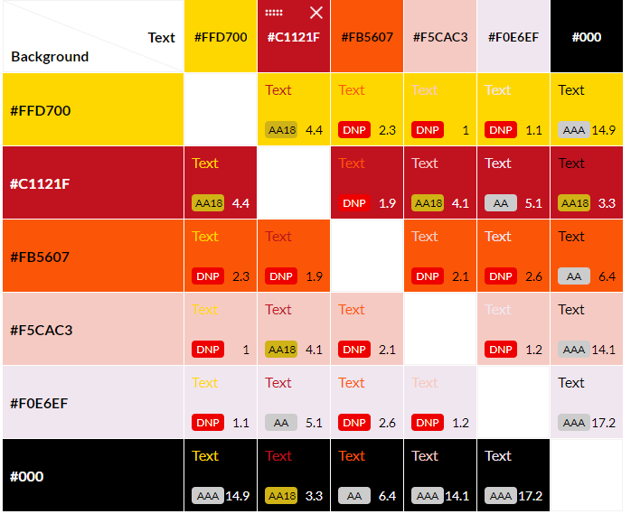
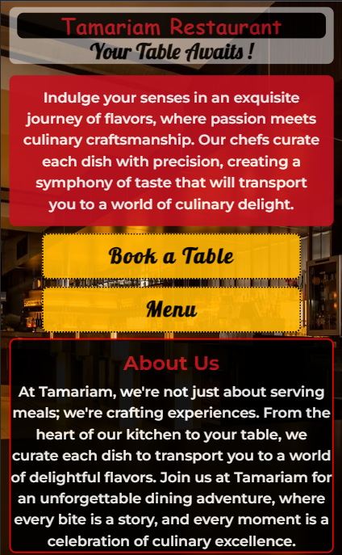
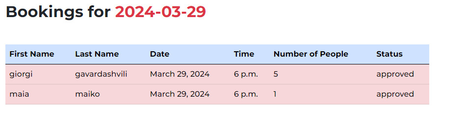
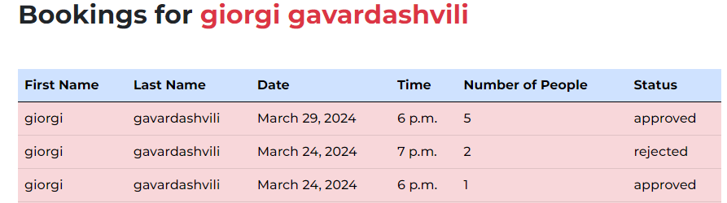
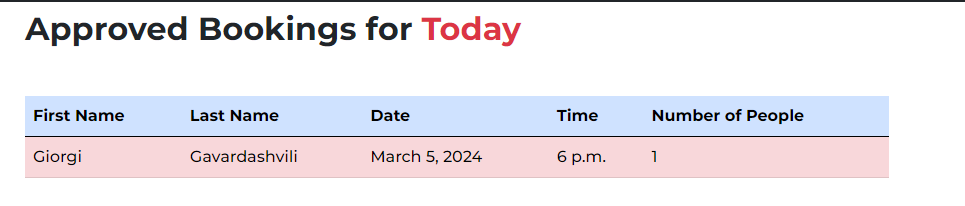
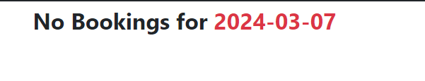
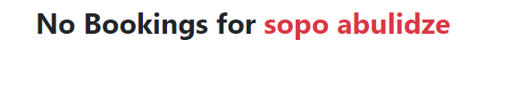
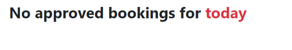
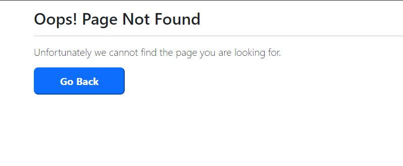

# Restaurant Tamariam 

Welcome to the Django Restaurant Booking Site! This web application empowers users to explore our restaurant's delightful menu and  make Bookings online. Built on Django, a high-level Python web framework, this project aims to provide a comprehensive solution for managing restaurant reservations while offering an exceptional user experience.

Please check  [live link](https://tamariamrestaurant-d81c96b3d785.herokuapp.com)

# Table of Contents
- [Planning and Design](#planning-and-design)
  - [Project-Goalss](#project-goals)
  - [User Stories and Epics](#user-stories-and-epics)
  - [Wireframes](#wireframes)
  - [Database Schema](#database-schema) 
  - [Design Elements](#design-elements)
   - [Typography](#typography)
   - [Colour Palette](#colour-palette)
- [Features](#features)
   - [Navigation Bar](#navigation-bar) 
   - [Homepage](#homepage)
   - [Footer](#footer)
   - [Account Managament](#account-managament)
   - [Menu](#menu)
   - [Booking Page](#booking-page)
   - [Dashboard Page](#dashboard-page)
- [Future Development](#future-development)
- [Testing](#testing)
- [Deployment](#dployment)
   - [Heroku Deployment](#heroku-deployment)
   - [ElephantSQL Database](#elephantsql-database)
   - [Cloudinary API](#cloudinary-api)
   - [Forking the Repository](#forking-the-repository)
   - [Cloning The Repository](#cloning-the-repository)
- [Tecnologies used](#technologies-used)
- [Credits](#credits)
- [Acknowledgements](#acknowledgements)

# Planning and Design

## Project Goals

The  primary goal  of the site is to create user-friendly reservation experience for customers and staff members. Wemy  aim is to streamline the process of booking a table, making it intuitive and efficient. Users should be able to easily choose their preferred date and time, enhancing their overall dining experience. The goal is to provide users with a visually appealing and informative interface where they can explore menu items and view descriptions.For administrators, the focus is on creating a powerful reservation management system. This includes tools to view, edit, and update reservations.

## User Stories and epics

I developed this project applying Agile methodology. Even though it's a solo project, I followed Agile principles to learn about flexible development and delivering small improvements over time. The project reflects my commitment to understanding modern software development approaches.
In adopting an Agile development approach, i start  creating epics which were broken down into user stories, each representing a specific feature. I utilized the MoSCoW prioritization (Must have, Should have, Could have, Won't have) to categorize and prioritize each user story based on its importance.

For better planning and estimation, I assigned labels and story points to each user story, considering factors such as time and difficulty. This approach helped me gauge the relative effort required for different tasks and maintain a clear sense of priority. Also every user story includes acceptance criteria and associated tasks.Also I found it beneficial to transition to organizing my work into sprints with milestones. I structured the project into seven sprints, each with its own set of milestones. By grouping related user stories into each sprint, I could efficiently tackle tasks in a more focused manner.

Presented below is a compilation of completed and closed user stories for this project organized by epics.

 - Epic-1 Setting up working enviroment

   - As a developer I can **install Django and essential libraries**,
so that I can **quickly set up a robust development environment and kickstart my web projects with confidence**..
   - As a developer, my goal is to **establish a secure environment for managing confidential configuration variables**., so that **sensitive information remains confidential, allowing me to uphold the privacy of critical data within the system**.
   - As a developer I want to **deploy the website on Heroku** so that i can **test its functionality in a live environment and make the completed site accessible to the public**.

- Epic-2 User Experience

   - As a **site user** I want to **navigate through landing page** so that **i can easily access various sections**
   - As a **user** I can **register my account** so that I can **log in and log out** in my account.
   - As a **user** I can **login or logout** from my account so that i **can use all features of site.**
   - As a **logged in user** I can **view my details** so that i can **review and manage my personal information.**
   - As a **logged in user** I can **change my account details** so that i can **keep my personal info up to date.**
   - As a **logged in user** I can **change my password** so that I can **keep my account secure.**
   - As a **logged in user** I can **reset my password** so that **i can still login my account if i forget my password**
   - As a **user** I can **view Menu** so that i can **check available food choices**
   - As a **logged in user** I can **book a table** so that i can **reserve place in restaurant** for a specific time.
   - As a **Logged in user** I can **view my booking details** so that i can **make sure everything is correct**.
   - As a **logged in user** I can **change my bookings** so that i can **change any details of booking** if i need.
   - As a **logged in user** I can **cancel my existing booking** so that i **do not need to call to restaurant to cancel it.**
   - As a **logged in user** I can **receive feedback how successful was my booking** so that  **i can book it again if booking was not successful**

- Epic-3 Staff Management and Administration.

  - As a **staff member** I can **access staff dashboard** so that i can **manage site content and bookings**
  - As a **staff member** I can **search bookings by date** so that i can **easyly find out how meny bookings restaurant have on specific date**
  - As a  **staff member**  I can **search bookings by name** so that **i can easily  find out reservation status for specific user**
  - As a **staff member** I can  **search todays bookings**  so that i can **easily find out  how many  approved bookings does restaurant have for today**
  - As a **staff member** **manage menu items from admin panel** so that i can **keep menu page up to date**
  - As a **Site owner** I can **limit access to specific features to registered users** so that **Encourage site membership to enhance participation and guarantee the accurate recording of reservations for known customers**
  - As a **Site owner** I want **limit access to specific functionalities to staff members** so that **prevent unauthorized users from interfering with its operations**
  - As a **staff member** I can **manage booking requests** so that **i can control restauran bookings**

Please check all user storys[here](https://github.com/users/tamariam/projects/9)

## Wireframes

 I used [Balsamique](https://balsamiq.com/) to create wireframes for my project.These were adapted and improved upon throughout the development process.The wireframes encompass the main pages of the project, with each page extending the base HTML structure that includes navigation and footer elements.The wireframes display designs for desktop, mobile, and tablet views, mainly focusing on the homepage. Additionally, I've created wireframes for the desktop and mobile menu. However, wireframes for other pages are specifically for desktop. On mobile screens, elements are arranged from top to bottom for readability and usability. Even though the content and features remain consistent across devices, I decided against creating separate wireframes for mobile and tablet views. Instead, I used the desktop wireframes as a base to guide adaptation for smaller screens, ensuring visual consistency throughout the application. Tablet screens closely resemble the desktop version, while mobile screens show slight variations, particularly in the menu layout. These wireframes offer a clear visual representation of device differences, with most pages following the desktop layout.

  
Homepage - Desktop (click to expand)

  
Homepage - Tablet (click to expand)

  
Homepage - Mobile (click to expand)

  
Profile-page-wireframe (click to expand)

  
Signup-Wireframe (click to expand)

  
Login-Wireframe (click to expand)

  
Menu-Wireframe-Desktop (click to expand)

  
Menu-Wireframe-Mobile (click to expand)

  
Booking-Wireframe (click to expand)

  
Dashboard-Wireframe (click to expand)

## Database Schema

 I used [lucid.app](https://lucid.app/) to create database schema for my project .  The primary model in the project is the Booking model, tightly integrated with Django's built-in User model via a foreign key relationship. This linkage guarantees that if a user decides to delete their account, all corresponding booking data will be  removed, maintaining database consistency and user privacy.Moreover, the booking process automatically populates user details. This feature ensures  efficient booking experience for users, as their personal information is automatically filled in, reducing manual input and improving usability..

 I create separate menu model to provide better management of menu items.This model facilitates the addition, updating, and deletion of menu items. Each menu item includes details such as its name, ingredients, price, availability, status, category, and featured image.By separating the menu-related functionalities into its own model, it simplifies the process of menu management and ensures a more organized database structure.

## Design Elements

### Colour Palette

* The color palette was chosen with [coolers](https://coolors.co/) and consists of 4 simple colours as seen above.

The main color is black, noticeable in the navbar and footer, giving the site a modern and stylish appearance.

Touches of red and yellow are added to add some variety and match the restaurant theme.

Additionally, a bit of pink is used for the login page and booking tables, giving the site a bit of flair.

Alongside these colors, standard Bootstrap colors are used for buttons, links, and to highlight certain text and messages.

Adapting the above throughout the development process. The final list of colors used has been placed in the below [color grid](https://contrast-grid.eightshapes.com/?version=1.1.0&background-colors=&foreground-colorscompact&es-color-form__show-contrast=aaa&es-color-form__show-contrast=aa&es-color-form__show-contrast=aa18&es-color-form__show-contrast=dnp) to check contrast scores.

### Typography  

This project incorporates carefully selected Fonts to enhance the visual appeal:"Montserrat" with sans-serif as primary font, "Lobster" and "dancing script"  as secondary fonts.The mix of these  fonts contributes to a visually engaging and invitind user experience.

# Features

## Navigation Bar

The project showcases a modern and responsive navigation bar,designed with bootstrap, enhancing user experience across various devices. Key features of the navigation bar include:

- Navbar Brand:
 - A centered brand link, titled "Tamariam," serves as a clickable link to the home page, ensuring a clear and prominent identity.
Navbar Toggler:

- A responsive toggle button is incorporated for smaller screens, enabling easy access to navigation links on mobile devices.
Navigation Links:

- The navigation links consist of:
Home: Users are directed to the home page, with an 'active' indicator if the current page is the home page.
Menu: Navigates to the menu section.
Book: Provides a link to the booking section.

  
Navigation - Mobile (click to expand)

## Homepage

The responsive homepage starts with a captivating background image, setting the mood for a delightful dining experience.
- the homepage includes essential information about the restaurant. This ensures that visitors not only enjoy the aesthetics but also gather key details about what makes place special.
- To enhance user experience, two prominent buttons are strategically placed:

  - Menu
  - Book a Table

  
Homepage - Tablet (click to expand)

  
Homepage - Mobile (click to expand)

## Footer

The footer of  Tamariam Restaurant website provides essential information and additional ways to connect with restaurnt staff..

  
Footer - Tablet (click to expand)

 

  
Footer - Mobile (click to expand)

## Account Managment

In my project, I utilized Django Allauth to implement a user-friendly and well-designed account management system.

- Sign Up

The signup feature allows users to create a new account on the platform. Upon signing up, users are required to verify their email address for account activation. This feature is implemented using django-allauth.

- Upon submitting the signup form, the system sends a verification link to the user's provided email address and users are redirected to a page confirming that a verification link has been sent to their email address.

- Login 
  - A registered user can log in to the page by clicking on the login button in the navigation menu. The user only needs to enter their username and password.

- Once logged in, a message will be displayed on the page to confirm that user is logged in.
  

- logout
  - When a user is already logged in, they can access the logout option in the navigation menu. Upon clicking this option, the user will be prompted to confirm if they wish to log out. If the user confirms, they will be logged out, and an appropriate message will be displayed on the page to confirm that the user has been successfully logged out.

## Profile page
- loged in users  have the option to navigate to the profile page  from the menu.

- Profile page allows logged-in users to oversee and update their profile information and bookings conveniently.It conists with three section:
  - Greeting and Profile Overview: Users are greeted with a personalized message and provided with an overview of the profile page instructions.
  - Profile Management Area: In this section, users can update their profile details.
  - Booking Management: Users can efficiently manage their bookings, including viewing, editing, or canceling them.

## Update  Profile

- Registered users have the ability to update their profile details by selecting the appropriate option from the profile page.When a user opts to modify their account, a form pre-filled with their existing information is presented. After submitting the updated details, the user's account is successfully modified.

After the profile is updated, a relevant message will be displayed on the page.

- Change password 

- Logged-in users also have the option to change their passwords if they wish. A link to facilitate password changes is provided on the update profile page. Upon clicking the link, users will be redirected to the change password page. After entering their current password, confirming the new one, and clicking the "Change Password" button, the password will be updated, and a relevant message will be displayed.

 

- Password Reset

- The password reset feature allows users to reset their passwords in case they forget them. This feature is also implemented using django-allauth.
If a user forgets their password, they can click on the "Forgot Password" link on the login page.Upon clicking the "Forgot Password" link, the user is redirected to the password reset page.On the password reset page, the user can enter their email address associated with their account and click the "Reset Password" button.

- Clicking on the password reset link redirects the user to a page confirming that the password reset link has been sent to their email address.

- The user follows the instructions in the email and clicks on the password reset link.
This action redirects the user to a page where they can enter a new password and confirm it.
After successfully resetting the password from the email, the user is redirected to a page confirming that their password has been successfully reset.

##  My  bookings

- In the 'My Bookings' section, users can view details of their existing bookings, including the status of each booking. Additionally, users have the option to update or delete their bookings as needed.

- When there are no bookings, the 'My Bookings' section will display an appropriate message indicating that there are no bookings currently associated with the user's account.

- When a user clicks on the 'Update' button in the 'My Bookings' section, they will be redirected to the update booking page. The form on this page is identical to the booking form, with the only difference being that the booking details are prepopulated with the current booking information. Users can then make changes to these details as needed.

The update booking system operates similarly to the booking system, ensuring that users cannot make duplicate bookings. Additionally, if the restaurant is fully booked or if the requested number of guests exceeds the maximum capacity, the user will be unable to proceed with the update request, and an appropriate message will be displayed to notify the user. Clicking the cancel button on the update booking form  will navigate the user back  to the profile page.

- When the user clicks 'Save' on the update booking form, a message will be displayed to notify the user that the booking details have been successfully updated.

## Delete booking

- Upon navigating to the cancellation booking page, users will see the details of their booking, including the date, time, and number of guests. A confirmation message will prompt users to confirm their decision to proceed with deleting the booking record.Clicking the cancel button will navigate the user back  to the profile page.

 

  
Delete-booking - Mobile (click to expand)

  

After confirming the deletion, a message will be displayed to notify the user that the booking record has been successfully deleted.

.

- Delete account
 - Registered users have the option to delete their accounts at any time directly from the profile page by clicking the "Delete Account" button. Upon clicking, they will receive a warning indicating that confirming deletion will result in the loss of all their data. Users can either change their minds and click "Cancel" or, if they confirm deletion, their account will be permanently deleted.

 

 

## Menu

- Menu page provides a smooth navigation experience, particularly on mobile devices. Users can easily navigate through different sections of the menu using the navigation links.
To provide real-time information to our users, the menu page dynamically adjusts the display based on item availability. If a menu item is unavailable, it's clearly indicated as "Currently Unavailable" instead of displaying the price.The menu page showcases three types of dish courses: starters, mains, and desserts. Each course is presented with its name, price, and a visually appealing image, enhancing the overall user interface.

 

 

  
Menu - Mobile (click to expand)

## Booking page

Upon clicking the "Book" button in the navbar or the "Book a Table" button on the home page, users will be directed to the booking page. Here, they can make reservations using a form that allows them to select the date, time, and number of guests for their booking. After submitting the form, users will receive a feedback message confirming their reservation submission.Clicking the cancel button will navigate the user back  to the Home page.
Our system checks the availability of tables for the specified date and time.

 

  
Booking-page- Mobile (click to expand)

To access the booking page, users need to be logged in to their account. If you are not logged in, they  will be redirected to the login page. Upon redirection, a message will prompt you to either log in or register if you do not have an account yet. 

If the restaurant is fully booked on the requested date,  message will display indicating that no reservations are available for that specific date.Given that this restaurant is evening-only operation, once a full reservation is made for any time slot during restaurant operating hours (6:00 PM to 11:00 PM), it indicates that the restaurant is fully booked for the entire evening. As a result, no additional bookings can be accepted for that evening, ensuring an exclusive dining experience for our guests.

If the user already has a booking for a specific date and time, a message will be displayed to notify them that they cannot make another booking for the same date and time.

If there are already approved bookings for the specified date, and the number of people the user intends to book exceeds the available capacity,  the  message will display indicating that they cannot book for that date.

## Dashboard Page

The Staff Dashboard is made for  staf members to manage bookings.As a staff member logging in, you're directed to the home page initially. From there, you have the option to navigate to the dashboard from the menu. Once ypu are on  dashboard page  you can  review pending, approved, and rejected bookings. Additionally,  search functionality allows you to find bookings by name, date, or quickly check today's approved bookings.. 

In cases where there are no bookings att all or there are no pending, approved, or rejected bookings, the dashboard displays appropriate text on the page instead of the booking lists. This ensures clarity for staff members, indicating that there are currently no bookings requiring action or review. By providing clear feedback, staff can easily understand the current status and focus on other tasks as necessary.

Staff members have the authority to accept or reject pending bookings directly from the dashboard. Upon accepting or rejecting a booking, an immediate message displays on the page confirming the action. Simultaneously, the booking is promptly moved to the appropriate section - either the approved or rejected bookings list. Additionally, an email notification is automatically sent to the user, informing them of the updated status of their booking.

If a staff member is searching for a specific booking by date, name, or today's bookings, they are redirected to another page dedicated to displaying the specific booking details. On this page, if the requested booking is found, its details are displayed. However, if no matching booking is found, appropriate text is displayed, providing feedback that the requested booking could not be found. This ensures a streamlined experience for staff members, allowing them to quickly locate specific bookings and providing clear feedback in cases where the requested booking is not available.

  
bookings-by -date(click to expand)

  
bookings-by -name(click to expand)

 

  
approved-bookings-for-today(click to expand)

 

  
no bookings-by-date(click to expand)

 

  
no-bookings-by-name(click to expand)

 

  
no approved-bookings-today(click to expand)

This project is designed to enforce specific restrictions for different user roles. Staff members are explicitly prohibited from accessing the booking page. Should a staff member attempt to navigate to the booking page by clicking on the "Book" option in the menu, an appropriate message will promptly notify them of their restricted access, preventing them from proceeding further. This tailored approach ensures that each user role has distinct permissions aligned with their responsibilities, promoting a secure and efficient system environment.

## 404 Page Not Found Error Page:

This error shows when a user types a URL into the browser which does not exist within the app's domain.

[Back to top](#contents)

##  Future Development

While the current project iteration meets immediate requirements, there are several features that i plan to  implementing in the future to enhance user experience:

* Social Media Sign-In: 

Provide users with the ability to sign in using their social media accounts, offering convenience and flexibility in authentication.
* Menu Management from Staff Dashboard: 

Enable staff members to add, update, and delete menu items directly from the dashboard instead of admin panel.
* Email Address Restriction: 

Implement a feature to prevent re-registration with email addresses already associated with existing accounts. 
* Automated Login After Sign-Up/Password Reset:

 Update sign-up and password reset functionality to automatically log users in to their accounts upon successful completion, eliminating the need for additional login steps and providing a smoother user experience.
## Testing

I have included testing details in a separate document called [testing](TESTING.md).

## Deployment

### Heroku Deployment

The project was deployed using [Heroku](https://id.heroku.com/login).

After account setup, deployment steps are as follows:

1. Select **New** in the top-right corner of your Heroku Dashboard, and select **Create new app** from the dropdown menu.
2. App name must be unique, and then choose a region closest to you (EU or USA), and finally, select **Create App**.
3. Navigate to the settings tab and click **Reveal config vars**  and add the config vars necessary for the project:
 `CLOUDINARY_URL`(insert your own Cloudinary API key here )                        
 `DATABASE_URL`           (insert your own ElephantSQL database URL ) 
 `DISABLE_COLLECTSTATIC`  1 (temporary) 
 `SECRET_KEY`             (random secret key )                                  
 
Also make sure you create Procfile and requirements.txt file.

4. Navigate to the **Deploy** section by clicking the "Deploy" tab in the navbar, Select **GitHub** as the deployment method and click **Connect to GitHub**.
5. Find the repository wehich you want to deploy and click on **connect**.
6. Find button **Deploy Branch** at the bottom of page.
7. After clicking **Deploy Branch** button it will take few minutes to deploy site and you will have ability to view it  clicking on **view** button.

###  ElephantSQL Database

This project uses [ElephantSQL](https://www.elephantsql.com) for the PostgreSQL Database.

To set up a database, please follow these steps:

1. Sign up or log in to ElephantSQL with your GitHub account.
2. Click on **Create New Instance**.
3. Enter a name for the instance.(project name)
4. Select **Tiny Turtle (Free)** free plan.
5. The "Tags" field can be left blank.
6. Click **Select Region**.
7. Select a data center near you.
8. Click **Review**, make sure that all details are correct and then click "Create instance".
9. Once created, click on the new database name, where you can view the database URL and Password.

### Cloudinary Api

[Cloudinary](https://cloudinary.com/) is used in this project to store media assets. 

Follow these steps to  create Cloudinary Api Key :

1. Login/sign up to Cloudinary.
2. On your Cloudinary  dashboard to view the **API Environment Variable**.

### Cloning the Repository

This project can be cloned or forked in order to make a local copy on your own system.

For either method, you will need to install any applicable packages found within the _requirements.txt_ file.

You can clone the repository by following these steps:

1. Go to the [GitHub repository](https://github.com/tamariam/restaurant-Tamariam)
2. Locate the Code button above the list of files and click it
3. Select if you prefer to clone using HTTPS, SSH, or GitHub CLI and click the copy button to copy the URL to your clipboard
4. Open Git Bash or Terminal
5. Change the current working directory to the one where you want the cloned directory
6. In your IDE Terminal, type the following command to clone my repository:
  `git clone https://github.com/tamariam/restaurant-Tamariam`  then press Enterr.

### Forking the Repository

To create a copy of the repository for viewing and editing without affecting the original repository you can fork the repository through the following steps:

1. In my repository[github repository](https://github.com/tamariam/restaurant-Tamariam) click on the "fork" tab in the top right corner.
2. Then click **create fork**  and it will fork the repository in your github account.

# **Technologies used**

* Python
  * The packages installed for the is project can be found in [the requirements.txt](requirements.txt)
* Django
  * Django was used as the python framework in the project.
  * Django all auth was used to handle user authentication and related tasks i.e. sign in, sign up, sign out.
* Heroku
  * Used to deploy the page and make it publicly available.
* Heroku PostgreSQL
  * Used for the database during development and in deployment.
* HTML
  * HTML was the base language used to layout the skeleton of all templates.
* CSS
  * Custom CSS used to style the page and make the appearance look a little more unique.
* Javascript
  * I have used JavaScript to automatically hide displayed messages after a few seconds.
* Bootstrap 5.0.1
  * Used to style HTML and CSS
* Font awesome
  * All icons throughout the page.

  # Credits

* [Balsamiq](https://balsamiq.com/wireframes/) was used to create the wireframes.
* [lucid.app](https://lucid.app/users/login#/login) was used to create ERD
* The site was developed using [gitpod](https://www.gitpod.io/).
* [GitHub](https://github.com/) was used to store my repository.
* Responsive screenshot made using [amiresponsive.com](https://ui.dev/amiresponsive)
* [Article on writing good user stories](https://www.industriallogic.com/blog/as-a-developer-is-not-a-user-story/)
* [coolers.co](https://coolors.co/603f3f-a0acca-e4b67c-de9f13-000000) was used to generate color scheme.
* [eightshapes-contast grid](https://contrast-grid.eightshapes.com/) to check contrast of colours.
* Fonts were taken from [Google Fonts](https://fonts.google.com/)
* Images:
  * for all images used for site  taken from [pixels.com](https://www.pexels.com/) 
* Multiple videos sourced from youtube :
    * [django-wednesdays](https://www.youtube.com/watch?v=HHx3tTQWUx0&list=PLCC34OHNcOtqW9BJmgQPPzUpJ8hl49AGy)
    * [Learn Django - Class-Based Views series](https://youtu.be/ScteNE1jB4g)
* General references:
    * [Stack Overflow](https://stackoverflow.com/)
    * [Code Institute Learning Platform](https://codeinstitute.net/)
    * [Django Documentation](https://docs.djangoproject.com/en/3.2/)
    * [Bootstrap Documentation](https://getbootstrap.com/)

# Acknowledgements

This site was developed as a fourth portfolio project for the [Code Institute](https://codeinstitute.net/global/) course in Full Stack Software Development. I would like to thank the following for all of the support throughout the development phase.

* The Code Institute community, including Tutor Support, Student Care and the Slack Community.
* My mentor, [David Bowers](https://www.linkedin.com/in/dnlbowers/) for providing me with advice throughout the development process.