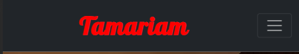
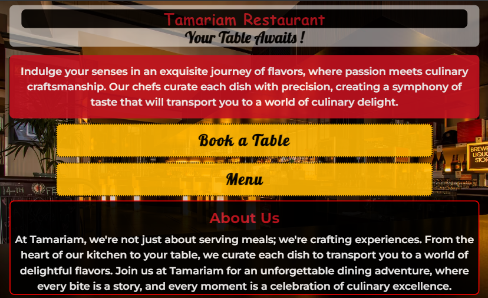
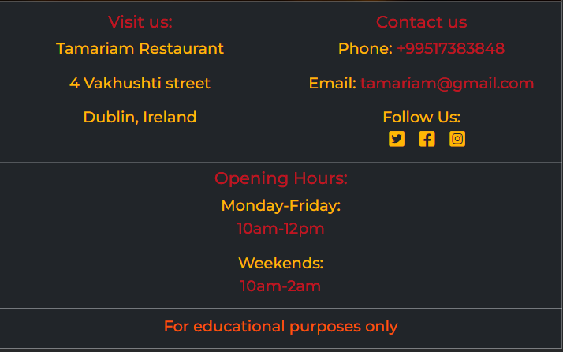
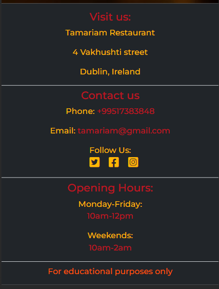
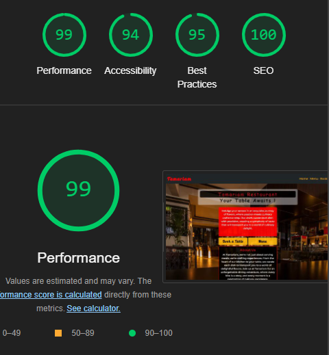
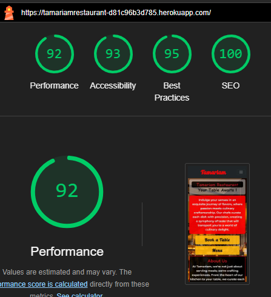

# Restaurant Tamariam

Welcome to the Django Restaurant Reservation Site! This web application empowers users to explore our restaurant's delightful menu and seamlessly make reservations online. Built on Django, a high-level Python web framework, this project aims to provide a comprehensive solution for managing restaurant reservations while offering an exceptional user experience.Please check live Url here 

# Table of Contents

- [Planning and Design](#planning-and-design)
  - [Project-Goalss](#project-goals)
  - [User Stories and Epics](#user-stories-and-epics)
  - [Wireframes](#wireframes)
  - [Design Elements](#design-elements)
   - [Typography](#typography)
  - [Database Schema](#database-schema) 
- [Features](#features)
   - [Navigation Bar](#navigation-bar) 
   - [Homepage](#homepage)
   - [Footer](#footer)
- [Deployment](#dployment)
   - [Heroku Deployment](#heroku-deployment)
   - [ElephantSQL Database](#elephantsql-database)
   - [Cloudinary API](#cloudinary-api)
   - [Forking the Repository](#forking-the-repository)
   - [Cloning The Repository](#cloning-the-repository)
- [Testing](#testing)
  - [lighthouse Testing](#lighthouse-testing)

# Planning and Design

## Project Goals

The  primary goal  of the site is to create a seamless and user-friendly reservation experience for customers and staff members. We aim to streamline the process of booking a table, making it intuitive and efficient. Users should be able to easily choose their preferred date and time, enhancing their overall dining experience. The goal is to provide users with a visually appealing and informative interface where they can explore menu items and view descriptions.For administrators, the focus is on creating a powerful reservation management system. This includes tools to view, edit, and update reservations seamlessly.

## User Stories and epics

 I developed this project applying Agile methodology. Even though it's a solo project, I followed Agile principles to learn about flexible development and delivering small improvements over time. The project reflects my commitment to understanding modern software development approaches.
In adopting an Agile development approach, i start  creating epics which were broken down into user stories, each representing a specific feature. I utilized the MoSCoW prioritization (Must have, Should have, Could have, Won't have) to categorize and prioritize each user story based on its importance.

For better planning and estimation, I assigned labels and story points to each user story, considering factors such as time and difficulty. This approach helped me gauge the relative effort required for different tasks and maintain a clear sense of priority. Also every user story includes acceptance criteria and associated tasks.

Presented below is a compilation of completed and closed user stories for this project organized by epics.

 - Epic- Setting up working enviroment
   - As a developer I can **install Django and essential libraries**,
so that I can **quickly set up a robust development environment and kickstart my web projects with confidence**..
   - As a developer, my goal is to **establish a secure environment for managing confidential configuration variables**., so that **sensitive information remains confidential, allowing me to uphold the privacy of critical data within the system**.
   - As a developer I want to **deploy the website on Heroku** so that i can **test its functionality in a live environment and make the completed site accessible to the public**.

- Epic- User Experience
   - As a site user I want to **navigate through landing page** so that **i can easily access various sections**]

Please check all user storys[here](https://github.com/users/tamariam/projects/9)

## Wireframes
 I used [Balsamique](https://balsamiq.com/) to create wireframes for my project.These were adapted and improved upon throughout the development process. Here are the wireframes for the main pages:

 

  
Homepage - Desktop (click to expand)

  
Homepage - Tablet (click to expand)

  
Homepage - Mobile (click to expand)

## Design Elements

### Typography  

This project incorporates carefully selected Google Fonts to enhance the visual appeal:
"Montserrat" with sans-serif as secondary font, "Lobster "
"Dancing Script".
The mix of these  fonts contributes to a visually engaging and invitind user experience.

## Database Schema

# Features

## Navigation Bar

The project showcases a modern and responsive navigation bar,designed with bootstrap, enhancing user experience across various devices. Key features of the navigation bar include:

- Navbar Brand:
 - A centered brand link, titled "Tamariam," serves as a clickable link to the home page, ensuring a clear and prominent identity.
Navbar Toggler:

- A responsive toggle button is incorporated for smaller screens, enabling easy access to navigation links on mobile devices.
Navigation Links:

The navigation links consist of:
Home: Users are directed to the home page, with an 'active' indicator if the current page is the home page.
Menu: Navigates to the menu section.
Book: Provides a link to the booking section.

  
Navigation - Mobile (click to expand)

## Homepage
The responsive homepage starts with a captivating background image, setting the mood for a delightful dining experience.
- the homepage includes essential information about the restaurant. This ensures that visitors not only enjoy the aesthetics but also gather key details about what makes place special.
- To enhance user experience, two prominent buttons are strategically placed:

  - Menu
  - Book a Table

  
Homepage - Tablet (click to expand)

 

  
Homepage - Mobile (click to expand)

## Footer

The footer of  Tamariam Restaurant website provides essential information and additional ways to connect with restaurnt staff..

 

  
Footer - Tablet (click to expand)

 

  
Footer - Mobile (click to expand)

# Testing 

## Lighthouse testing

Chrome DevTools Lighthouse was used to test Performance, Accessibility, Best Practices and SEO.
- Desktop  Testing with [Chrome DevTools Lighthouse](https://developers.google.com/web/tools/lighthouse)

 

  
lighthouse-Testing-Desktop (click to expand)

- Mobile  Testing with [Chrome DevTools Lighthouse](https://developers.google.com/web/tools/lighthouse)

 
lighthouse-Testing-Mobile (click to expand)

# Deployment

## Heroku Deployment

The project was deployed using [Heroku](https://id.heroku.com/login).

After account setup, deployment steps are as follows:

1. Select **New** in the top-right corner of your Heroku Dashboard, and select **Create new app** from the dropdown menu.
2. App name must be unique, and then choose a region closest to you (EU or USA), and finally, select **Create App**.
3.Navigate to the settings tab and click **Reveal config vars**  and add the config vars necessary for the project:
 `CLOUDINARY_URL`(insert your own Cloudinary API key here )                        
 `DATABASE_URL`           (insert your own ElephantSQL database URL ) 
 `DISABLE_COLLECTSTATIC`  1 (temporary) 
 `SECRET_KEY`             (random secret key )                                  
 
 Also make sure you create Procfile and requirements.txt file.

4. Navigate to the **Deploy** section by clicking the "Deploy" tab in the navbar, Select **GitHub** as the deployment method and click **Connect to GitHub**.
5. Find the repository wehich you want to deploy and click on **connect**.
6. Find button **Deploy Branch** at the bottom of page.
7. After clicking **Deploy Branch** button it will take few minutes to deploy site and you will have ability to view it  clicking on **view** button.

##  ElephantSQL Database

This project uses [ElephantSQL](https://www.elephantsql.com) for the PostgreSQL Database.

To set up a database, please follow these steps:

1. Sign up or log in to ElephantSQL with your GitHub account.
2. Click on **Create New Instance**.
3. Enter a name for the instance.(project name)
4. Select **Tiny Turtle (Free)** free plan.
5. The "Tags" field can be left blank.
6. Click **Select Region**.
7. Select a data center near you.
8. Click **Review**, make sure that all details are correct and then click "Create instance".
9.Once created, click on the new database name, where you can view the database URL and Password.

## Cloudinary Api

[Cloudinary](https://cloudinary.com/) is used in this project to store media assets. 

Follow these steps to  create Cloudinary Api Key :

1. Login/sign up to Cloudinary.
2.On your Cloudinary  dashboard to view the **API Environment Variable**.

### Cloning the Repository

This project can be cloned or forked in order to make a local copy on your own system.

For either method, you will need to install any applicable packages found within the _requirements.txt_ file.

You can clone the repository by following these steps:

1. Go to the [GitHub repository](https://github.com/tamariam/restaurant-Tamariam)
2. Locate the Code button above the list of files and click it
3. Select if you prefer to clone using HTTPS, SSH, or GitHub CLI and click the copy button to copy the URL to your clipboard
4. Open Git Bash or Terminal
5. Change the current working directory to the one where you want the cloned directory
6. In your IDE Terminal, type the following command to clone my repository:
  `git clone https://github.com/tamariam/restaurant-Tamariam`  then press Enterr.

### Forking the Repository

To create a copy of the repository for viewing and editing without affecting the original repository you can fork the repository through the following steps:

1. In my repository[github repository](https://github.com/tamariam/restaurant-Tamariam) click on the "fork" tab in the top right corner.
2. Then click **create fork**  and it will fork the repository in your github account.
