# Testing 
## Manual Testing

- I have manualy tested this project by doing the folowing:
  - I checked this project using DevTools' device toolbar and confirmed that it looks responsive on all screen types.
  - all sections are readeble and easy to understand.
  - The site works in different browsers:Firefox,Chrome,Safari.
  - I Tested that  links  on footer page works  and opens in new window.
  - I've tested each button to ensure they perform their designated tasks with excellence.
- additoinal testing for each page:

* ### Initial Django Setup
    * This was development related and all criteria was met.
    * Necessary packages were installed successfully.
    * Config variables were successfully secured.
    * The site was deployed successfully.

### Home Page
- Functionality Testing: Test navigation links, and  interactive elements.
- Responsiveness Testing: Ensure the page layout adjusts correctly on different devices.
- Content Review: Verify that the introductory content accurately represents the purpose of the website.

### account managament
- The manual testing of the account management functionality confirms that users can create accounts, log in, log out, change passwords, reset passwords, and delete accounts without encountering any significant issues. All expected features have been verified, and the application meets security standards: 

#### Sign Up Option in Navigation:

- The sign-up option is prominently displayed in the website navigation menu.
- Users who are not registered can easily locate the sign-up option on the homepage alongside the login option.
- Upon clicking the sign-up option, users are directed to the registration page without any errors or inconsistencies.

### Sign Up Page

- Users can successfully create accounts by providing required details.
- Verification emails are sent promptly upon registration.
- Clicking on the verification link activates the user account.
- After activation, users are asking to  log in.
- Password strength requirements are enforced during account creation.
- Proper error  messages are displayed  for invalid input during registration.

### User Authentication:

- Users receive appropriate error messages for incorrect login credentials.
- Session management is effective, and users remain logged in until they choose to log out or session expires.
- Remember me functionality, if available, works as expected, allowing users to stay logged in across sessions.
- Upon successful login, a confirmation message is displayed on the homepage indicating that the user has been logged in.

### profile page
- Confirmed that the "Profile" link is only visible and accessible to logged-in users.
- Verified that user details such as username  email and bookings related to the user are correctly displayed on the profile page.

### update profile 

- Successfully updated account details (username, first name,last name email address)  changes were saved correctly and appropriate message is displayed.

### Change Password:

- Users can change their passwords without encountering any issues.
- Password change form validates input and enforces password strength requirements.
- Upon successful password change, users  redirect on profile page and confirmation message displays.
- Users cannot change passwords without providing the correct current password.

### Reset Password:

- Users can reset their passwords  by clicking ''forgot password '' button on login page.
- An email containing a password reset link is sent to the provided email address.
- Clicking the reset link directs the user to a secure reset password page within the application, where they can enter a new password into the provided form fields.
- After successfully resetting the password, the application displays a confirmation message to the user, confirming that the password has been changed.

### Delete Account:

- The account deletion process is successful, and the account is removed from the system.
- Confirmation  question is displayed before account deletion to prevent accidental deletions.
- Deleting an account removes all associated user data .
- Users cannot access their accounts after deletion, and attempts to log in with deleted account credentials fail.

### Menu
- Successfully accessed the menu page from the navigation bar or designated menu link.
- Verified that menu items, including their descriptions, pictures, and prices, are displayed correctly on the menu page.
- Confirmed that changes made to menu items, descriptions, pictures, and prices from the admin panel reflect accurately on the menu page.
- Tested the functionality to mark menu items as currently unavailable from the admin panel. Verified that unavailable menu items are appropriately displayed on menu page.
- Tested the menu page across different web browsers to ensure consistent display and functionality.
- Ensured that changes to prices from the admin panel are reflected accurately on the menu page.
- Ensured that menu item pictures are of high quality and consistent in size and format.
- Verified that if no image is uploaded for a menu item, a placeholder image is displayed.

### Booking

- Confirmed that non-logged-in users are redirected to the login page when attempting to access the booking page.
- Ensured that only logged-in users can access the booking page directly.
- Checked that the login prompt on the booking page is clear and instructive, informing users to log in to make a booking.
- Verified that users can input required booking details such as date, time and number of people, without encountering any errors.
- Verified that booking requests are successfully processed and stored in the backend database.
- After successfully submitting a booking, verified that  confirmation message  displays indicating that their booking request has been  submited.
- Tested the form validation to ensure users cannot select past dates.
- Tested the booking process to ensure that users cannot make double bookings for the same  time slot.
- Checked that the system prevents overbooking by limiting the number of available slots for each date.
- Tested by submitting booking requests that exceed the available capacity for a specific date and confirmed that the system rejects the request with a notification indicating that the booking capacity has been reached.
- Verified that users can access and modify their existing bookings from their profile page.
- Attempted to update bookings that are pending or approved by changing the date, time, or number of people, and confirmed that the changes are saved correctly.
- Attempted to delete bookings and confirmed that the deletion process removes the booking from the system without any errors.

### staff
- Verified that the staff dashboard link only appears on home page if user is  a staff member.
- Tested by logging in with both staff and non-staff accounts to ensure the visibility of the dashboard link is correct.
- Verified that staff members can access a list of pending bookings and  can approve or reject  on each booking request.
- Ensured that the system updates the booking status accordingly and notifies users of the outcome.
- Tested the functionality to display success/error messages o in the staff dashboard and verified they  work as expected.
- Verified that staff members can search for specific bookings by customer name or booking date.
- Verified that staff members can access a list of approved bookings for the current day.
- Verified that if a staff member searches for bookings by a specific user and no bookings are found, a message indicating "No bookings found for [user] is displayed.
- Verified that if a staff member searches for bookings by a specific date/current day and no bookings are found, a message indicating "No bookings found for [date] is displayed.
- verified that when a staff member attempts to access the booking link in the navigation bar, the system appropriately denies access and displays a notification message informing the staff member that they are not authorized to view the page.

- There is only  r line too long in settings py file which can not be shortened.

## Lighthouse testing

Chrome DevTools Lighthouse was used to test Performance, Accessibility, Best Practices and SEO.
- Desktop  Testing with [Chrome DevTools Lighthouse](https://developers.google.com/web/tools/lighthouse)

 

  
lighthouse-Testing--Home-Desktop (click to expand)

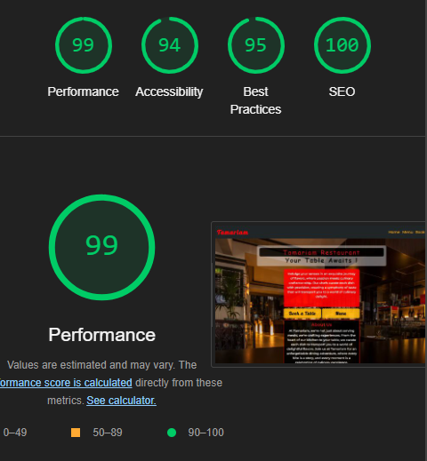

- Mobile  Testing with [Chrome DevTools Lighthouse](https://developers.google.com/web/tools/lighthouse)

 
lighthouse-Testing-Home-Mobile (click to expand)

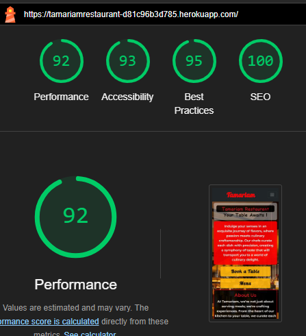

### Account authentication testing with lighthouse:

  
lighthouse-Testing-SignUp-Desktop (click to expand)

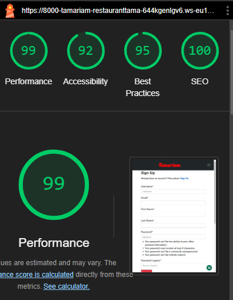

  
lighthouse-Testing-SignUp-Mobile (click to expand)

  
lighthouse-Testing-Verification-Sent(click to expand)

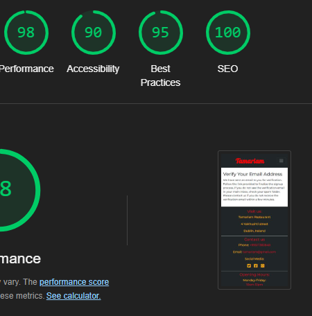

  
lighthouse-Testing-Confirm-Email-mobile (click to expand)

  
lighthouse-Testing-Confirm-Email-Desktop (click to expand)

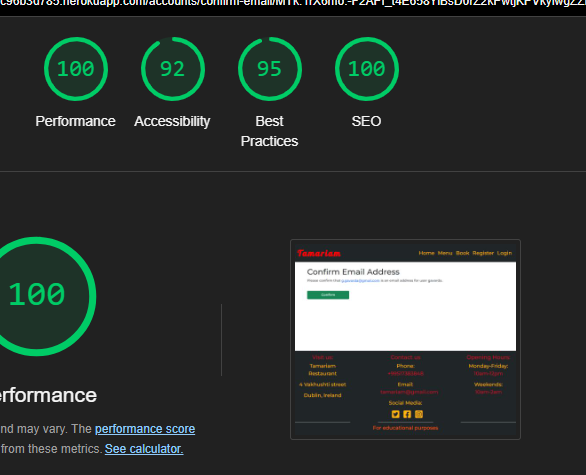

  
lighthouse-Testing-Login-Mobile (click to expand)

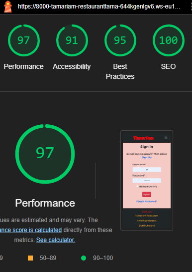

  
lighthouse-Testing-Login-Desktop (click to expand)

  
lighthouse-Testing-Logout-Desktop (click to expand)

  
lighthouse-Testing-Logout-Mobile (click to expand)

 
lighthouse-Testing-Pofile-page-Desktop (click to expand)

 
lighthouse-Testing-Pofile-page-Mobile (click to expand)

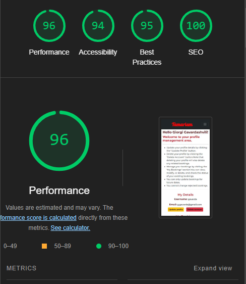

 
lighthouse-Testing-Delete-account-Desktop (click to expand)

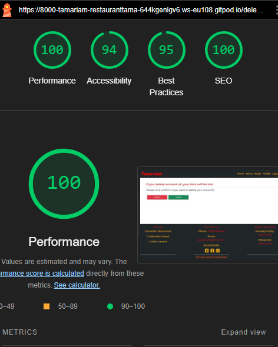

 
lighthouse-Testing-Delete-account-Mobile (click to expand)

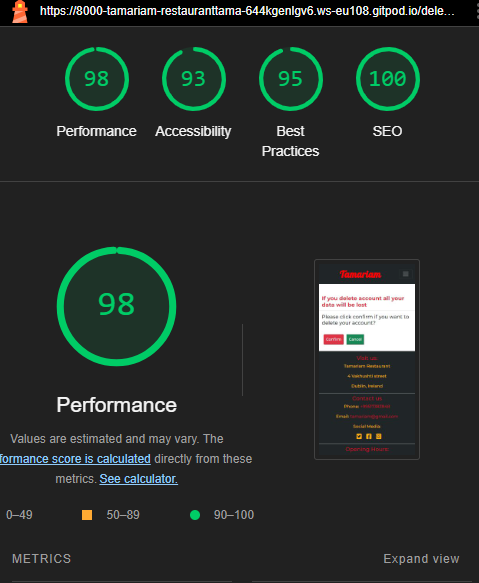

lighthouse-Testing-Update-profile-Desktop (click to expand)

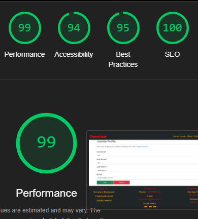

  
lighthouse-Testing-Update-profile-Mobile (click to expand)

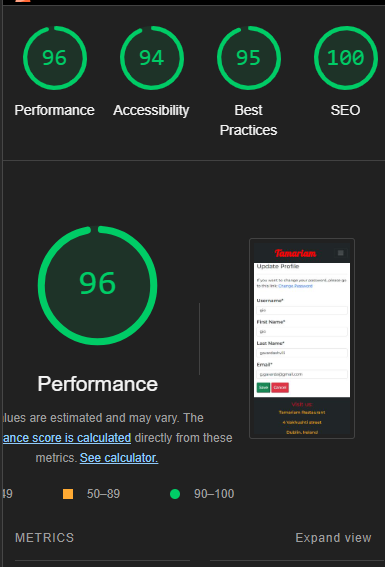

  

  
lighthouse-Testing-Logout-Desktop (click to expand)

  
lighthouse-Testing-Change-Password-Mobile (click to expand)

  
lighthouse-Testing-Change-Password-Desktop (click to expand)

  
lighthouse-Testing-Password-Reset-Mobile (click to expand)

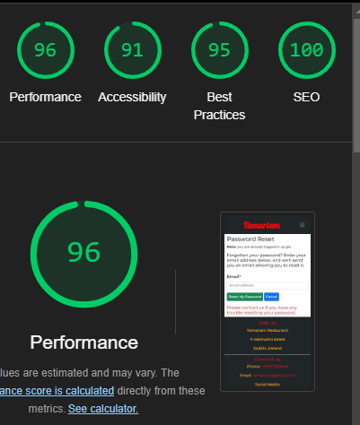

  
lighthouse-Testing-Password-Reset-Desktop (click to expand)

  
lighthouse-Testing-Password-Reset-form-mobile (click to expand)

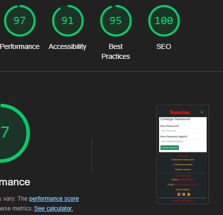

  
lighthouse-Testing-Password-Reset-form-desktop (click to expand)

  
lighthouse-Testing-succesfully-reset-password (click to expand)

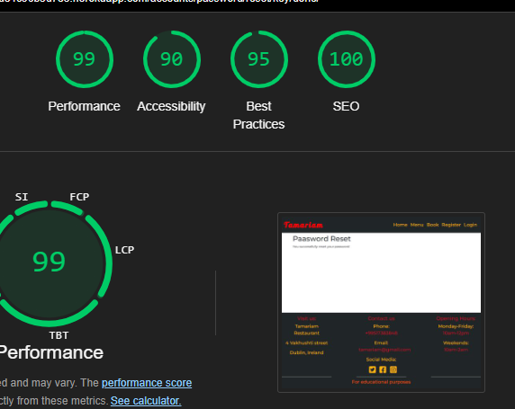

### Menu testing with lighthouse

  
lighthouse-Testing-Menu-Desktop (click to expand)

  
lighthouse-Testing-Menu-Mobile (click to expand)

### Booking page testing with lighthouse

lighthouse-Testing-Booking page-Desktop (click to expand)

lighthouse-Testing-Booking page-Mobile (click to expand)

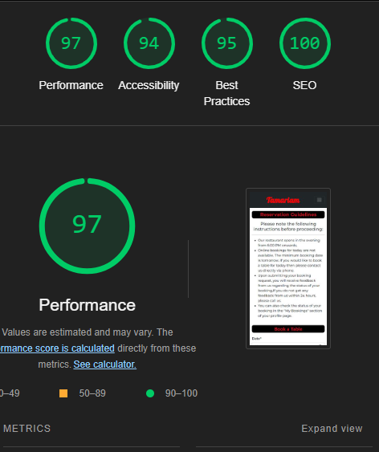

lighthouse-Testing-Update-Booking-Desktop (click to expand)

lighthouse-Testing-Update-Booking-Mobile (click to expand)

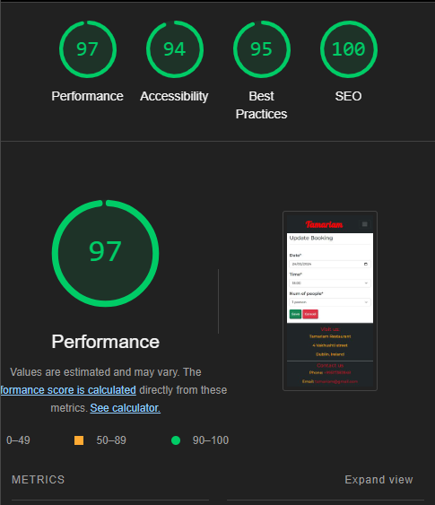

lighthouse-Testing-Delete-Booking-Desktop (click to expand)

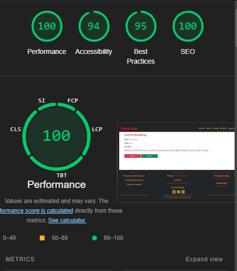

lighthouse-Testing-Delete-Booking-Mobile (click to expand)

## staff dashboard testing with lighthouse

lighthouse-Testing-staff-dashboard-Mobile (click to expand)

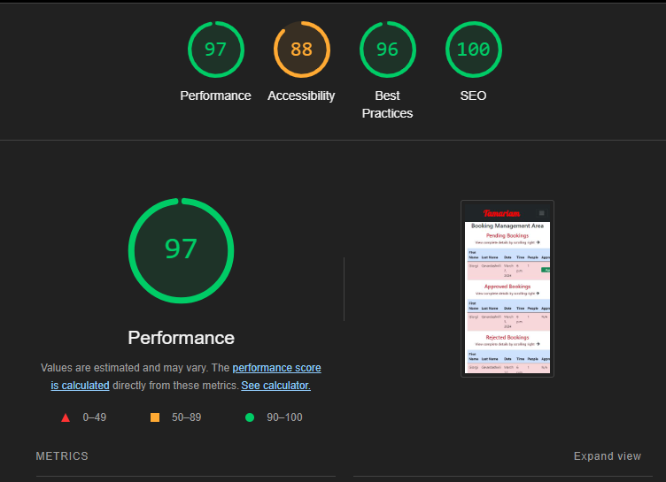

lighthouse-Testing-staff-dashboard-Desktop (click to expand)

approved-bookings-by-date-Desktop (click to expand)

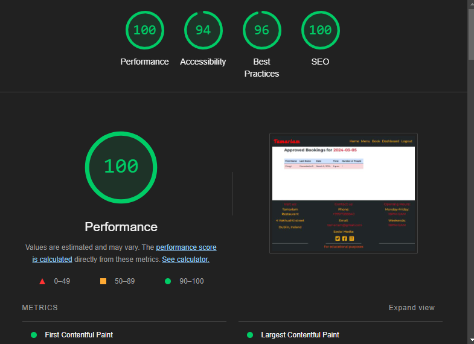

approved-bookings-by-Name-Mobile (click to expand)

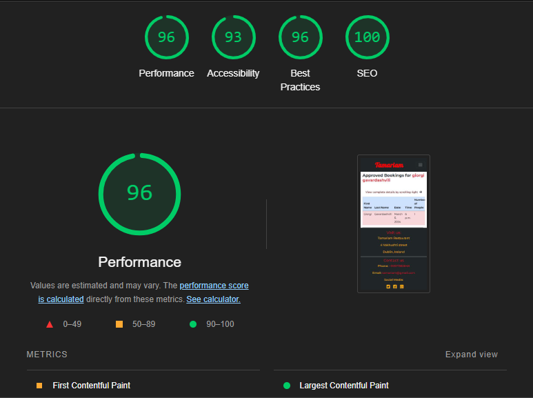

### validation testing

- HTML

  -During validation [W3C HTML Validator](https://validator.w3.org/) a few problems were presented in different html files but after correcting the relevant issues, no warnings or errors were shown.This problemss are mentioned in Bugs section.

  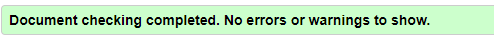

- CSS

  - No errors were found when passing through the official [W3C CSS Validator](https://jigsaw.w3.org/css-validator/) validator.

  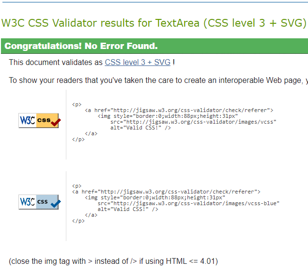

- Js

  - No errors were found when final passing through the official  [JSHint](https://jshint.com/) validator.

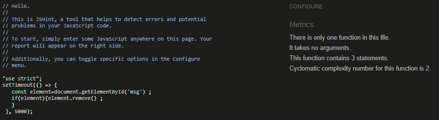

PEP8:
Before using the pep8 validator I ran autopep8 --in-place --aggressive --aggressive <file name> on all py files.

Due to this, the only error I found was in settings.py with AUTH_PASSWORD_VALIDATORS .

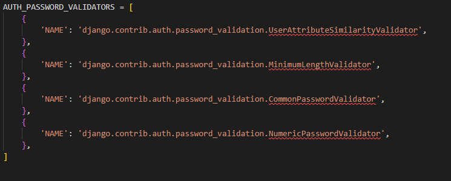

I tried to solve this issue but Django seems to think shortening these lines is ill advisable. For this reason, I left them to be longer than 80 characters.All final python files presented no warnings or errors.

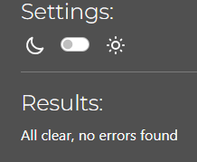

### Browser Compatibility

The site was tested on the following browsers and the appearance, functionality and, responsiveness were consistent throughout.

Google Chrome
Mozila firefox
Microsoft Edge
Safari

### Bugs 

### fixed

HTML:

During the HTML validation process, several errors were identified and resolved:

1.Unclosed 
 Tags:

Issue: The validation flagged unclosed 
 tags, which occurred due to reusing code blocks without removing unnecessary 
 tags.
Resolution: The error was resolved by carefully reviewing and removing redundant 
 tags.

2.Opening Tags Without Closing Tags:
Issue: The validation detected opening tags without corresponding closing tags. This happened when a block of code was deleted, inadvertently removing a necessary closing 
 tag.
Resolution: The error was resolved by reinstating the deleted closing 
 tag.
Error: Start Tag 
 Seen in Table:

3.Issue: The validation reported an error when a 
 tag was inadvertently placed inside a <table> element.
Resolution: After recognizing the mistake, the 
 tag was moved outside the <table> tag, resolving the error.

4.element p not allowed as child of element h4:
 The problem caused from the use of the {{ item.name | safe }} filter. Despite not including any 
 tags in the template:<h4>{{ item.name }}</h4> the rendered HTML was unexpectedly displaying as:<h4>
item.name 
</h4> Although this filter was meant to render the content safely, it led to the inclusion of unwanted 
 tags.To resolve the issue, the | safe filter was replaced with | striptags, which effectively removed any HTML tags from the rendered output. This approach ensured that only the item names and ingredients were displayed within the <h4> elements, resolving the validation error.

5.Mixed Content The page at was loaded over HTTPS but requested an insecure resource This request has been blocked the content must be served over HTTPS :
While  testing the menu page, a "Mixed Content" error occurred in the browser console, indicating that the page was loaded over HTTPS but requested insecure resources, causing the browser to block them. To address this issue, I added the following code to the base HTML:<meta http-equiv="Content-Security-Policy" content="upgrade-insecure-requests"> This directive instructs the browser to automatically upgrade any HTTP requests to HTTPS. also in menu html add crossorigin="anonymous" to all img tags.  As a result, the Mixed Content errors were resolved, and the Lighthouse Best Practices score improved from 68 to 100.

6. On the booking page, the notification message about a submitted booking was incorrectly displayed on the left side instead of the center. To correct this issue, the Bootstrap class mx-auto was applied to the message div, ensuring it is horizontally centered on the page.

#### Python
During the Python code validation process, the following warnings were identified and promptly resolved:

Blank Spaces:

Issue: Blank spaces were detected within the code.
Resolution: Extr blank spaces were removed from the codebase, ensuring cleaner and more consistent formatting.
Trailing Spaces:
Issue: Trailing spaces were present at the end of lines in the code.
Resolution: Trailing spaces were eliminated from the code, enhancing readability and adhering to coding standards.
Line Length Exceeded:
Issue: Some lines in the code exceeded the recommended maximum line length.
Resolution: Long lines were refactored or split into shorter segments.

####  Functrionality testing

1. Issue:
When users registered with their email addresses, confirmation emails were not being sent.
Cause:
The email settings in the settings.py file were incomplete, missing necessary configurations for handling outgoing emails.
Solution:
To resolve this issue, I added the following settings in the settings.py file:
EMAIL_BACKEND = "django.core.mail.backends.smtp.EmailBackend"
(replace console. with smtp to handle email on signing up for the issue)
These additional settings specified the email backend as SMTP allowing emails to be sent out when users sign up..
2. Issue:
After the first registration, three messages were displayed together on homepage: one indicating a successful email sent to the address, another confirming successful registration, and the third indicating successful log in.

Cause:
The message display code was not properly structured, resulting in multiple messages appearing  together on the homepage.
Solution:
To address this issue:
I added specific message display code to the verification_sent.html template to ensure that messages are only displayed on the appropriate page after email verification.
I implemented separate message displays on the profile page to provide accurate feedback when the verification process is completed.

3. Issue: During testing of the booking functionality, an issue was encountered where error handling only worked for users who had previously booked. New users attempting to book on dates that were already fully booked were still able to proceed with their booking.

Addressing the Issue: To resolve this issue, I updated the booking_page view to include a new variable called new_booking. This variable checks whether the new booking aligns with existing bookings. Now, the system examines all existing bookings, and if the new booking does not exceed the capacity, it can be confirmed. This ensures that both existing and new users are properly restricted from booking on fully booked dates.
4. During testing of the update booking page, two issues were encountered. The first issue was the inability to update only the number of people in a booking.

Addressing the Issue:
To resolve this issue, I modified the update booking system to specifically check whether only the number of people had been changed. This modification ensures that updates are accurately applied without requiring changes to other booking details.and user can update number of people without any problem.

5. The second issue occurred when users attempted to update their details along with the number of people in a booking. Despite exceeding the maximum capacity, the booking was still updated.
Addressing the Issue:
To resolve this issue, I further modified the update booking system. Now, the system verifies whether the updated booking request exceeds the maximum capacity of people before saving the changes. If the capacity is exceeded, the booking is not saved and appropriate message displays to notify user.

6. 
Issue:
During testing of the staff dashboard's search functionality by name, bookings were displayed even when entering just one letter from the name.

Addressing the Issue:
To enhance the search functionality, I updated the search_name view to ensure that bookings are only displayed when the entire name is entered.

### Unfixed bugs
There is no unfixed bugs.

